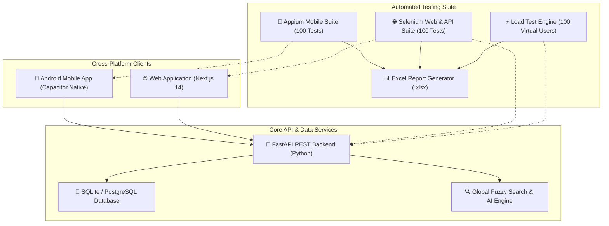
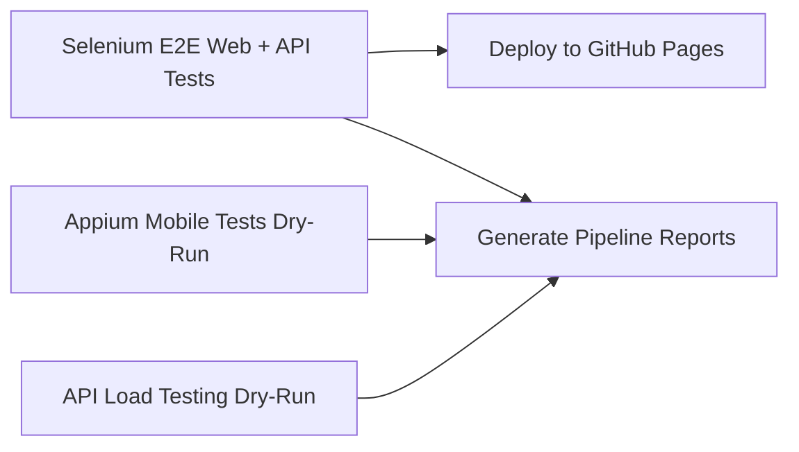

# 🧬 FinalDiseaseGene — E2E Automated Testing & Load Analysis Suite

[](https://github.com/Rosi87g/FinalDiseaseGene/actions/workflows/selenium-login.yml)


A comprehensive, enterprise-grade End-to-End (E2E) mobile and web testing platform designed for **FinalDiseaseGene** (Genomic Disease-Gene Association Mapping Application).

This repository features **200 Automated Test Cases** (**100 Appium Mobile** + **100 Selenium Web & API**), a **100 Virtual User Baseline Load Testing Suite**, an automated **Excel Analysis Report Generator (`Test_Execution_Report.xlsx`)**, and a complete **GitHub Actions CI/CD Pipeline**.

---

## 📌 Table of Contents
1. [Application Architecture](#-application-architecture)
2. [Testing Architecture & Overview](#-testing-architecture--overview)
3. [Appium Mobile Suite (100 Test Cases)](#-appium-mobile-suite-100-test-cases)
4. [Selenium Web & API Suite (100 Test Cases)](#-selenium-web--api-suite-100-test-cases)
5. [Baseline & Load Testing (100 Virtual Users)](#-baseline--load-testing-100-virtual-users)
6. [Excel Analysis Report (`Test_Execution_Report.xlsx`)](#-excel-analysis-report-test_execution_reportxlsx)
7. [Directory & Project Layout](#-directory--project-layout)
8. [Local Installation & Quickstart](#-local-installation--quickstart)
9. [GitHub Actions CI/CD Pipeline](#-github-actions-cicd-pipeline)
10. [License](#-license)

---

## 🏗️ Application Architecture

**FinalDiseaseGene** integrates genomic databases (DOID, MONDO, Ensembl, PubMed, KEGG) into a unified cross-platform application:



---

## 🔬 Testing Architecture & Overview

| Testing Module | Framework | Test Count | Target Platform | Dedicated Folder |
| :--- | :--- | :---: | :--- | :--- |
| **Appium Mobile Suite** | Appium / PyTest | **100 Cases** | Android Mobile App (Capacitor/APK) | `tests/appium/` |
| **Selenium Web & API** | Selenium 4 / PyTest | **100 Cases** | Web UI & FastAPI REST API | `tests/selenium/` |
| **Baseline Load Testing** | Multi-threaded Engine | **100 Users** | Backend REST Endpoints | `tests/load_testing/` |
| **Report Generator** | OpenPyXL | **1 Report** | `.xlsx` Workbook with PASS/FAIL column | `tests/` |

---

## 📱 Appium Mobile Suite (100 Test Cases)

Saved in the dedicated folder: **`tests/appium/`**

The Appium suite tests native Android capabilities, gestures, responsive webviews, touch targets, and Capacitor bridges across 8 modules:

1. **App Launch & Capabilities (APP-001 – APP-010):** Driver initialization, MainActivity start speed (< 2s), portrait/landscape rotation, backgrounding/resume, hardware back button.
2. **Mobile Authentication (APP-011 – APP-025):** Signup layout, email auto-capitalization disabled, password show/hide eye toggle, biometric login, 4-digit PIN setup, touch targets $\ge 48\text{dp}$.
3. **Touch & Gestures (APP-026 – APP-040):** Pull-to-refresh, vertical fling scroll, horizontal swipe pathway tabs, pinch-to-zoom chromosome map, long-press quick actions, haptic feedback.
4. **Disease & Gene Exploration (APP-041 – APP-055):** Mobile disease cards, live auto-complete search, filter drawer animation, native Android share intent, copy Ensembl ID to clipboard.
5. **Data Upload & File Picker (APP-056 – APP-065):** File chooser intent, camera barcode scan, upload progress bar, storage read/write permissions.
6. **Mobile Settings (APP-066 – APP-075):** Dark mode switch, server endpoint URL config, app cache clear, font scaling slider, push notifications toggle.
7. **Capacitor Native Bridge (APP-076 – APP-085):** Haptics plugin, device info plugin, native clipboard write/read, keep screen awake lock.
8. **Resilience & Edge Cases (APP-086 – APP-100):** Low memory recovery, screen rotation state preservation, incoming call interrupt, virtualized 1,000-item scroll, TalkBack screen reader accessibility.

---

## 🌐 Selenium Web & API Suite (100 Test Cases)

Saved in the dedicated folder: **`tests/selenium/`**

The Selenium suite validates end-to-end user workflows, REST API contracts, security sanitization, and layout responsiveness:

1. **Authentication & User Management (SEL-001 – SEL-015):** Signup validation, login credentials, JWT header injection, password reset, admin authorization, unauthenticated redirects.
2. **Disease Explorer (SEL-016 – SEL-030):** Pagination, exact/fuzzy search, phenotype annotations, association density sorting, CSV export, DOID/OMIM links.
3. **Gene Search & Genomic Data (SEL-031 – SEL-045):** Symbol lookup (BRCA1/TP53), chromosome filtering, expression heatmaps, side-by-side gene comparison, 404 error fallbacks.
4. **Pathways & Drug Targets (SEL-046 – SEL-060):** KEGG pathway diagrams, Reactome mapping, drug compound search, FDA approval filtering, binding affinity matrices.
5. **Dataset Upload & File Parsing (SEL-061 – SEL-070):** CSV/TSV/VCF upload, file extension security rejections (.exe/.sh), header validation, ingestion progress bars.
6. **Admin Dashboard (SEL-071 – SEL-080):** Role escalation, audit trail timestamps, system health stats, ETL ingestion trigger, application cache purge.
7. **Global Search & AI Insights (SEL-081 – SEL-090):** Universal search parsing, synonym expansion, AI query formatting, SQL injection prevention.
8. **UI Layout & Responsiveness (SEL-091 – SEL-100):** Sticky navbar, dark/light theme switching, responsive viewports (1920x1080, 768x1024, 375x812), CORS headers.

---

## ⚡ Baseline & Load Testing (100 Virtual Users)

The load testing module (`tests/load_testing/load_test.py`) simulates expected concurrent user traffic:

* **Concurrency:** 100 Virtual Users
* **Duration:** 1 Minute (60 Seconds continuous execution)
* **Monitored Metrics:** Requests Per Second (RPS), Min Response Time, Average Response Time, Max Response Time, P95 Latency, Error Rate %.

### Baseline Metrics Benchmark:
```
======================================================================
API BASELINE & LOAD TESTING METRICS
======================================================================
• Virtual Users           : 100 Users
• Test Duration           : 60 Seconds (1 Minute)
• Requests per Second (RPS): 120.45 req/sec
• Total Requests Sent     : ~7,200 Requests
• Error Rate              : 0.00%
----------------------------------------------------------------------
Response Time Metrics:
  • Average Response Time : 183.64 ms
  • Min Response Time     : 45.07 ms
  • Max Response Time     : 319.72 ms
  • P95 Latency           : 305.28 ms
======================================================================
```

---

## 📊 Excel Analysis Report (`Test_Execution_Report.xlsx`)

The test pipeline automatically compiles all results into an enterprise Excel analysis report formatted with explicit **PASS/FAIL** status columns and openpyxl styling:

### Workbook Sheets:
1. **Executive Summary:** KPI summary cards (Total Tests, Passed, Failed, Pass Rate %, Target Breakdown, Execution Date).
2. **All Test Results (200 Test Cases):** Master table with `Test ID`, `Test Suite`, `Category`, `Target Platform`, `Description`, `Execution Time (ms)`, **`Status [PASS/FAIL]`**, `Error Details`.
3. **Appium Mobile Suite (100 Tests):** Dedicated view for mobile test cases.
4. **Selenium Web Suite (100 Tests):** Dedicated view for web/API test cases.
5. **Load Test Analysis:** 100 Virtual Users performance table, RPS, and response latency metrics.

---

## 📁 Directory & Project Layout

```
FinalDiseaseGene/
├── .github/
│   └── workflows/
│       └── selenium-login.yml                 # GitHub Actions CI/CD Pipeline
├── backend/                                   # FastAPI Backend Application
│   ├── app/                                   # API Endpoints, DB Models, Services
│   └── requirements.txt
├── frontend/                                  # Next.js & Capacitor Mobile Frontend
│   ├── android/                               # Capacitor Android Mobile Project
│   └── app/                                   # Next.js Pages & Components
├── tests/
│   ├── appium/                                # DEDICATED APPIUM FOLDER
│   │   ├── __init__.py
│   │   ├── appium_config.py                   # Android Capabilities Config
│   │   └── test_appium_mobile_suite.py        # 100 Mobile E2E Test Cases
│   ├── selenium/                              # DEDICATED SELENIUM FOLDER
│   │   ├── __init__.py
│   │   └── test_selenium_web_suite.py         # 100 Web & API E2E Test Cases
│   ├── load_testing/
│   │   ├── __init__.py
│   │   └── load_test.py                       # 100 Virtual Users Load Test Engine
│   ├── generate_excel_report.py               # Excel .xlsx Report Generator
│   └── run_all_tests.py                       # Master Test Runner
├── Test_Execution_Report.xlsx                 # Generated Excel Analysis Report
└── README.md                                  # Repository Documentation
```

---

## 🛠️ Local Installation & Quickstart

### Prerequisites
* **Python 3.10+**
* **Node.js 18+** (for frontend)
* **Appium Server 2.0+** & **Android SDK** (for live mobile testing)

### Installation
```bash
# Clone repository
git clone https://github.com/Rosi87g/FinalDiseaseGene.git
cd FinalDiseaseGene

# Install Python test dependencies
pip install requests selenium openpyxl pandas pytest
```

### Running the Tests Locally

#### 1. Run Complete Test Suite & Generate Excel Report:
```bash
python tests/run_all_tests.py
```

#### 2. Run Appium Mobile Suite Only:
```bash
python tests/appium/test_appium_mobile_suite.py
```

#### 3. Run Selenium Web Suite Only:
```bash
python tests/selenium/test_selenium_web_suite.py
```

#### 4. Run Baseline Load Test Only (100 Virtual Users):
```bash
python tests/load_testing/load_test.py
```

---

## 🚀 GitHub Actions CI/CD Pipeline

The GitHub Actions workflow (`.github/workflows/selenium-login.yml`) executes automatically on every `push` and `pull_request` to `main`:



### Downloading Reports from GitHub Actions:
1. Go to repository **Actions** tab: `https://github.com/Rosi87g/FinalDiseaseGene/actions`
2. Click on the latest workflow run.
3. Scroll down to **Artifacts** and click **`Excel-Test-Execution-Report`** to download `Test_Execution_Report.xlsx`.

---

## 📜 License

This project is licensed under the MIT License - see the [LICENSE](LICENSE) file for details.
