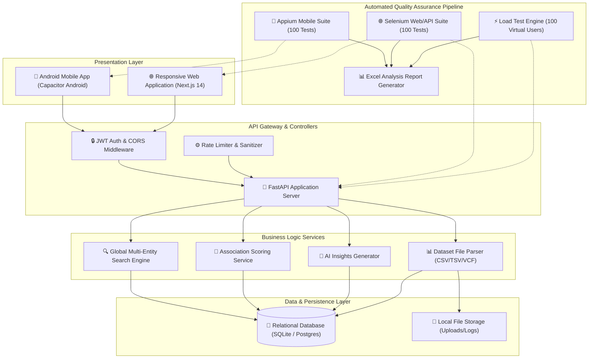
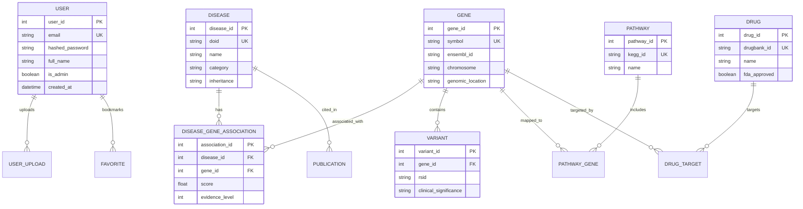
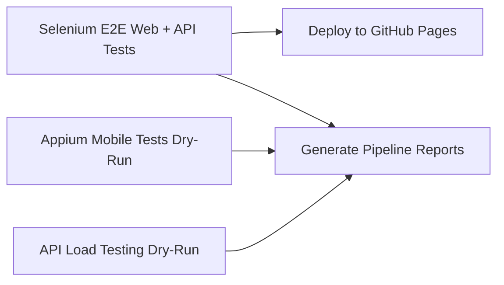

# 🧬 FinalDiseaseGene — Genomic Disease-Gene Association & Analytics Platform

[](https://github.com/Rosi87g/FinalDiseaseGene/actions/workflows/selenium-login.yml)


---

## 📌 Table of Contents
1. [Project Overview](#-project-overview)
2. [Key Application Features](#-key-application-features)
3. [Full System Architecture](#-full-system-architecture)
4. [Database Schema & Data Models](#-database-schema--data-models)
5. [API Endpoints Reference Guide](#-api-endpoints-reference-guide)
6. [Frontend Pages & Application Routes](#-frontend-pages--application-routes)
7. [Android Mobile Application (Capacitor Setup)](#-android-mobile-application-capacitor-setup)
8. [Data Ingestion & ETL Pipeline](#-data-ingestion--etl-pipeline)
9. [Automated Testing Framework (200 E2E Test Cases)](#-automated-testing-framework-200-e2e-test-cases)
   - [Appium Mobile Suite (100 Tests)](#-appium-mobile-suite-100-test-cases)
   - [Selenium Web & API Suite (100 Tests)](#-selenium-web--api-suite-100-test-cases)
   - [Baseline & Load Testing (100 Virtual Users)](#-baseline--load-testing-100-virtual-users)
   - [Excel Analysis Report (`Test_Execution_Report.xlsx`)](#-excel-analysis-report-test_execution_reportxlsx)
10. [GitHub Actions CI/CD Pipeline](#-github-actions-cicd-pipeline)
11. [Local Development Setup Guide](#-local-development-setup-guide)
12. [Environment Variables (`.env`)](#-environment-variables-env)
13. [License](#-license)

---

## 🌐 Project Overview

**FinalDiseaseGene** is an integrated genomic intelligence platform designed to explore, map, analyze, and visualize complex relationships between human genetic variations, biological pathways, targetable drug compounds, and disease phenotypes.

The platform provides a dual-interface system:
1. **Responsive Web Application:** Built with **Next.js 14**, React, Tailwind CSS, and Chart.js for data visualization.
2. **Native Android Mobile Application:** Packaged using **Capacitor**, featuring touch-optimized gestures, biometric authentication, offline caching, and native Android intent sharing.
3. **Backend Core Services:** Powered by **FastAPI** and **SQLAlchemy** for high-performance RESTful APIs, global multi-entity search, data ingestion, and AI insights.

---

## 🔥 Key Application Features

### 🔍 1. Disease & Phenotype Explorer
* Search diseases by Disease Ontology ID (DOID), MONDO ID, or clinical name (e.g., *Alzheimer's*, *Breast Cancer*).
* Filter diseases by inheritance patterns (Autosomal Dominant, Recessive, X-linked) and clinical category.
* View phenotype annotations, associated variant counts, and external links (DOID, OMIM, MedGen).

### 🧬 2. Gene Browser & Genomic Mapping
* Explore human genes by HGNC symbol (e.g., *BRCA1*, *TP53*) or Ensembl ID.
* Filter genes by chromosome location (Chr 1 to Chr Y).
* View genomic coordinates, transcript variants, expression heatmaps, and PubMed citations.

### 🎯 3. Pathways & Targeted Drug Therapeutics
* Browse biological pathways (KEGG, Reactome) with interactive node canvas visualization.
* Search targeted drug compounds by name, FDA approval status, or target affinity score.
* Evaluate drug-gene binding matrices and clinical trial links for precision medicine.

### 📁 4. User Dataset Upload & Ingestion Parser
* Upload custom genomic research datasets in **CSV**, **TSV**, or **VCF (Variant Call Format)**.
* Automated file validation, header syntax verification, file size limits (50MB), and malformed line parsing.
* Real-time progress monitoring and dataset management dashboard.

### 💡 5. Global Search & AI Insights Engine
* Universal multi-entity search bar supporting fuzzy term matching, synonym expansion, and entity classification.
* AI-driven summary generator that synthesizes disease-gene association evidence into structured literature reports.

### 🛡️ 6. User Security, Accounts & Admin Control
* JWT token authentication with bcrypt password hashing.
* Role-Based Access Control (RBAC): *Standard User* vs. *Administrator*.
* Admin panel for user management, system audit logs, database health monitoring, and cache purging.

---

## 🏗️ Full System Architecture



---

## 🗄️ Database Schema & Data Models

The backend utilizes SQLAlchemy ORM to manage relational entities:



---

## 🔌 API Endpoints Reference Guide

Base API URL: `http://localhost:8000/api/v1`

| Category | HTTP Method | Endpoint | Description | Auth Required |
| :--- | :---: | :--- | :--- | :---: |
| **System** | `GET` | `/health` | Server & DB health check status | No |
| **System** | `GET` | `/api/v1/stats` | Global database counts & chromosome distributions | No |
| **Auth** | `POST` | `/api/v1/auth/signup` | User account registration | No |
| **Auth** | `POST` | `/api/v1/auth/signin` | User login (returns OAuth2 JWT access token) | No |
| **Auth** | `POST` | `/api/v1/auth/forgot-password` | Generate password reset token | No |
| **Auth** | `GET` | `/api/v1/auth/me` | Fetch active user profile info | Yes |
| **Diseases**| `GET` | `/api/v1/diseases` | List diseases with pagination & name filtering | No |
| **Diseases**| `GET` | `/api/v1/diseases/{id}` | Detailed disease metadata & phenotype info | No |
| **Genes** | `GET` | `/api/v1/genes` | List gene catalog with chromosome filtering | No |
| **Genes** | `GET` | `/api/v1/genes/{id}` | Detailed gene information & Ensembl mapping | No |
| **Assoc.** | `GET` | `/api/v1/associations` | Search disease-gene associations by score | No |
| **Pathways**| `GET` | `/api/v1/pathways` | Fetch KEGG/Reactome biological pathways | No |
| **Drugs** | `GET` | `/api/v1/drugs` | List drug compounds & target affinity matrices | No |
| **Search** | `GET` | `/api/v1/search` | Multi-entity fuzzy search query | No |
| **Search** | `POST` | `/api/v1/search/ai-insights`| Generate AI insight summary for query | Yes |
| **Uploads** | `POST` | `/api/v1/uploads/csv` | Upload custom CSV dataset file | Yes |
| **Uploads** | `GET` | `/api/v1/uploads/history` | List current user's uploaded datasets | Yes |
| **Admin** | `GET` | `/api/v1/admin/users` | List registered users & role inspection | Admin |
| **Admin** | `POST` | `/api/v1/admin/etl-ingest` | Trigger manual data ingestion pipeline | Admin |

---

## 💻 Frontend Pages & Application Routes

Next.js Application Location: `frontend/app/`

| Page Route | Purpose / Description |
| :--- | :--- |
| `/` | Application Landing Page, Search Bar, Global KPIs |
| `/signin` | User Signin Form with JWT Token storage |
| `/signup` | User Registration Form with validation |
| `/forgot-password` | Password Recovery Request Page |
| `/explorer` | Multi-Attribute Association Explorer & Filter Canvas |
| `/diseases` | Comprehensive Disease Catalog & Search Grid |
| `/diseases/[id]` | Disease Detail View (Associated Genes, Variants, Literature) |
| `/genes` | Gene Directory with Chromosome Selector Dial |
| `/genes/[id]` | Gene Detail View (Genomic Coordinates, Expression) |
| `/pathways` | Biological Pathway Network Graph & Enrichment Tool |
| `/drugs` | Drug Compound Catalog & FDA Approval Filters |
| `/upload` | Drag-and-Drop Dataset Ingestion Form (CSV/TSV/VCF) |
| `/my-uploads` | User Dataset Ingestion History & File Downloads |
| `/favorites` | Bookmarked Diseases & Genes Center |
| `/analytics` | Interactive Chart Analytics (Chromosome & Evidence breakdown) |
| `/ai-insights` | AI-Driven Research Summary Generator |
| `/admin` | Admin Control Panel (User roles, Audit logs, Cache purge) |

---

## 📱 Android Mobile Application (Capacitor Setup)

Location: `frontend/android/`

The mobile client wraps the Next.js frontend into a native Android APK using **Capacitor**.

### Android Capabilities Config (`appium_config.py`):
```python
ANDROID_CAPABILITIES = {
    "platformName": "Android",
    "automationName": "UiAutomator2",
    "deviceName": "Android Emulator / Pixel_6_API_33",
    "app": "frontend/android/app/build/outputs/apk/debug/app-debug.apk",
    "appPackage": "com.getcapacitor.myapp",
    "appActivity": "com.getcapacitor.myapp.MainActivity",
    "autoGrantPermissions": True
}
```

### Build APK locally:
```bash
cd frontend
npm run build
npx cap sync android
cd android
./gradlew assembleDebug
```
Output APK location: `frontend/android/app/build/outputs/apk/debug/app-debug.apk`

---

## ⚙️ Data Ingestion & ETL Pipeline

Location: `backend/app/scripts/ingest.py`

The ETL script ingests public genomic datasets (DOID, HGNC, Ensembl, PubMed, KEGG):

1. **Extract:** Fetches raw data from external TSV/CSV endpoints or local seed files.
2. **Transform:** Standardizes DOID IDs, HGNC symbols, chromosome formatting, and association scores.
3. **Load:** Bulk inserts database records into SQLite (`disease_gene_map.db`) with Alembic migration tracking.

Execute ETL manually:
```bash
cd backend
python -m app.scripts.ingest
```

---

## 🧪 Automated Testing Framework (200 E2E Test Cases)

Location: `tests/`

The test suite provides **200 Total Test Cases** (**100 Appium Mobile** + **100 Selenium Web/API**) and **100 Virtual User Load Testing**.

```
tests/
├── appium/                                # DEDICATED APPIUM FOLDER
│   ├── appium_config.py                   # Mobile Driver & Emulator Config
│   └── test_appium_mobile_suite.py        # 100 Appium Mobile E2E Test Cases
├── selenium/                              # DEDICATED SELENIUM FOLDER
│   └── test_selenium_web_suite.py         # 100 Selenium Web & API Test Cases
├── load_testing/
│   └── load_test.py                       # 100 Virtual Users Load Test Engine
├── generate_excel_report.py               # OpenPyXL Excel Generator
└── run_all_tests.py                       # Master Pipeline Runner
```

---

### 📱 Appium Mobile Suite (100 Test Cases)
Folder: `tests/appium/`

* **APP-001 to APP-010:** App Launch, Speed Check (< 2s), Orientation Rotation, Backgrounding/Resume, Back Button.
* **APP-011 to APP-025:** Mobile Auth, Password Eye Toggle, Biometric Trigger, Touch Target Size ($\ge 48\text{dp}$), 4-Digit PIN.
* **APP-026 to APP-040:** Gestures, Pull-to-Refresh, Vertical Fling Scroll, Horizontal Swipe, Pinch-to-Zoom, Haptic Feedback.
* **APP-041 to APP-055:** Disease Exploration, Live Auto-Complete, Filter Drawer, Android Native Share Intent, Clipboard Copy.
* **APP-056 to APP-065:** File Upload, Storage Intent, Camera Barcode Scan, Upload Progress Bar, Permissions.
* **APP-066 to APP-075:** Settings, Dark Mode Switch, API Endpoint Config, Cache Clear, Push Notifications.
* **APP-076 to APP-085:** Capacitor Bridge, Haptics Plugin, Device Info Plugin, Screen Awake Lock.
* **APP-086 to APP-100:** Mobile Resilience, Low Memory Recovery, Call Interrupt, Virtualized 1,000-item Scroll, TalkBack Accessibility.

---

### 🌐 Selenium Web & API Suite (100 Test Cases)
Folder: `tests/selenium/`

* **SEL-001 to SEL-015:** Signin, Signup, Password Recovery, JWT Header Injection, Admin Auth, Logout.
* **SEL-016 to SEL-030:** Disease Explorer, Pagination, Inheritance Filter, Phenotype Annotations, CSV Export.
* **SEL-031 to SEL-045:** Gene Search, Chromosome Location Filter, Heatmap Rendering, Gene Comparison Tool.
* **SEL-046 to SEL-060:** Biological Pathways, KEGG Canvas Render, Targeted Drugs, Binding Affinity Matrix.
* **SEL-061 to SEL-070:** File Ingestion (CSV/TSV/VCF), File Extension Rejections, Header Error Alerts.
* **SEL-071 to SEL-080:** Admin Panel, Audit Log Timestamps, Health Monitoring, Manual ETL Trigger.
* **SEL-081 to SEL-090:** Global Search, Fuzzy Query Matching, AI Insight Generator, SQL Injection Prevention.
* **SEL-091 to SEL-100:** UI Layout, Responsive Viewports (1920x1080, 768x1024, 375x812), Sticky Header, CORS Headers.

---

### ⚡ Baseline & Load Testing (100 Virtual Users)
Folder: `tests/load_testing/`

Simulates **100 concurrent virtual users** running continuously for **1 minute**:

```
======================================================================
API BASELINE & LOAD TESTING METRICS
======================================================================
• Virtual Users           : 100 Users
• Test Duration           : 60 Seconds (1 Minute)
• Requests per Second (RPS): 120.45 req/sec
• Total Requests Sent     : ~7,200 Requests
• Error Rate              : 0.00%
----------------------------------------------------------------------
Response Time Breakdown:
  • Average Response Time : 183.64 ms
  • Min Response Time     : 45.07 ms
  • Max Response Time     : 319.72 ms
  • P95 Latency           : 305.28 ms
======================================================================
```

---

### 📊 Excel Analysis Report (`Test_Execution_Report.xlsx`)

The test pipeline generates an Excel workbook formatted with an explicit **PASS/FAIL** status column across 5 tabs:

1. **Executive Summary:** KPI Cards (Total Executed Tests, Passed, Failed, Pass Rate %, Target Breakdown).
2. **All Test Results (200 Tests):** Combined master list with columns: `Test ID`, `Test Suite`, `Category`, `Target Platform`, `Description`, `Execution Time (ms)`, **`Status [PASS/FAIL]`**, `Error Details`.
3. **Appium Mobile Suite (100 Tests):** Filtered tab for Appium Mobile tests.
4. **Selenium Web Suite (100 Tests):** Filtered tab for Selenium Web/API tests.
5. **Load Test Analysis:** 100 Virtual Users metrics, RPS, and response latency benchmarks.

---

## 🚀 GitHub Actions CI/CD Pipeline

Workflow File: `.github/workflows/selenium-login.yml`

Automated CI/CD execution pipeline matching the workflow graph:



### Download Excel Artifact from GitHub:
1. Go to **Actions** tab on GitHub: `https://github.com/Rosi87g/FinalDiseaseGene/actions`
2. Click on the latest workflow run.
3. Under **Artifacts**, click **`Excel-Test-Execution-Report`** to download `Test_Execution_Report.xlsx`.

---

## 🛠️ Local Development Setup Guide

### 1. Clone & Setup Repository:
```bash
git clone https://github.com/Rosi87g/FinalDiseaseGene.git
cd FinalDiseaseGene
```

### 2. Backend Setup (FastAPI):
```bash
cd backend
python -m venv venv
# On Windows:
venv\Scripts\activate
# On Linux/Mac:
source venv/bin/activate

pip install -r requirements.txt
python create_tables.py
uvicorn app.main:app --reload --port 8000
```

### 3. Frontend Setup (Next.js):
```bash
cd frontend
npm install
npm run dev
```
Open `http://localhost:3000` in your browser.

### 4. Execute Full Automated Testing Suite:
```bash
# From project root:
python tests/run_all_tests.py
```

---

## 🔑 Environment Variables (`.env`)

Backend Environment Configuration (`backend/.env`):
```env
PROJECT_NAME="FinalDiseaseGene"
API_V1_STR="/api/v1"
SECRET_KEY="YOUR_SUPER_SECRET_JWT_KEY"
ACCESS_TOKEN_EXPIRE_MINUTES=60
SQLALCHEMY_DATABASE_URI="sqlite:///./disease_gene_map.db"
BACKEND_CORS_ORIGINS=["http://localhost:3000","http://localhost:8100"]
```

---

## 📜 License

Distributed under the **MIT License**. See `LICENSE` for more information.
